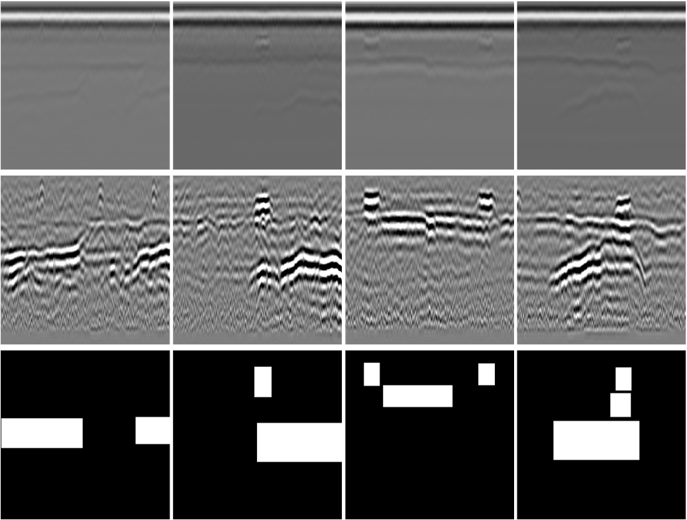

# GM-GRD
A large-scale real GPR dataset (GRD) for Ground Penetrating Radar B-Scan image research.

Samples from the GRD. The first row represents the raw GPR images, the second row represents the processed GPR images, the third row represents annotated images of subsurface defects.

## Instructions for Obtaining the Dataset
If you wish to obtain this database, please follow the steps below:

#### Read the License Agreement: Please click the link below to download the license agreement file and carefully read the relevant terms.
[Click to download the License Agreement](MIFVD_License_Agreement.pdf)

#### Fill out the Application Form: Complete the Access Application Form in the above-mentioned license agreement file.

#### Submit the Application: Send the filled-out Access Application Form to the designated email address wanghuabin@ahu.edu.cn.

We will review your application as soon as possible after receiving it. You will be granted access to the database upon successful review.

## Notes
#### Please ensure that you provide accurate and complete information when filling out the application form to avoid affecting the review process.
#### Strictly abide by all the terms in the license agreement and do not use the database for any unauthorized purposes.
